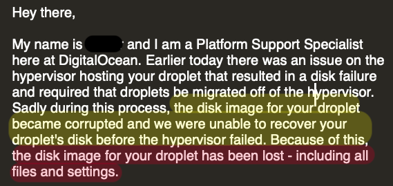

---
output:
  revealjs::revealjs_presentation:
    self_contained: false
    reveal_options:
      slideNumber: true
    theme: black
    css: "css/my_css.css"
    reveal_plugins: ["notes"]
    highlight: tango
    smart: false
---


```{r setup, include=FALSE}
knitr::opts_chunk$set(echo = FALSE)
library("fontawesome")
```

<section>

</br><h1 class ='title'>Focused Workflow to Share Reproducible Analysis</h1>
</br></br><h3  class= 'author'>`r fa("id-badge",fill = "white")` Hussain Alsalman</h3>
<h5 class = 'subtitles'>`r fa("twitter",fill = "white")` @Arabian_Analyst</h5>
<h5 class = 'subtitles'>`r fa("link",fill = "white")` https://ArabianAnalyst.com</h5>
<h5 class = 'subtitles'>`r fa("calendar-day",fill = "white")` `r Sys.Date()`</h5>
</br>

<aside class="notes">
Good morning everyone, thank you all for comming. My name is Hussain Alsalman and I am here today to talk about enhancing your analysis work flow to make it more reproducible and shareable. I will be talking about what it means to have reproducible and shareable analysis then we will dive into why should we care about it. Later, I will walk you through # of steps to achieve reproducibility and shareability in R. At the end, I will attempt to do a live demonstrate how you can do your analysis and share it analysis all from one IDE.  

Professionally, I work as a Planning & Performance Management Analyst at Saudi Aramco. Outside working hours, I am a data science enthusiast and blogger, so if you recognize me it is probably from twitter because I am very active there or maybe you have read one of my blogs on ArabianAnalyst.com.
 
</aside>

</section>

## little story first 

<aside class="notes">

Before we talk about analysis shareability and reproducibility, I want to share with you a personal story that motivated this talk and the workflow I adopted. 

I am very passionate about data science so in 2016 I started writing blogs about data wrangling and data acquisition and basicaly share everything new I learn about this field.  What I found that technical blogging is different than blogging about any other topics.

Because you usually start with the data importing then cleaning. Then you start transofrming and wrangling the data and explore many options to proceed to modeling. When it comes to modeling you try different models until you are satisfied with the results. Finaly you try to communicate your result in cohesive narrative. But the thing is that big part of the analysis and insight was gained during this loop of trial and error that is now lost because you did not document or capture right away.

plus now you have to worry about how are going to publish this results. For me, I was using Wordpress, so that meant that I have to export all the figures and charts I created and uploade them in specific order along with my narrative. 

As you can see this is neither the best nor the most efficient workflow you can adopt. 

However, I manged to keep doing that for almost a year and half until that happen

</aside>

## { data-background-image="./images/broken_site.png"  background-size="contain"  background-repeat="no-repeat"   }

<aside>

So I tried to go back 

</aside>

## What does it mean?

Reproducible Analysis: 
</br><q>tying 
<span class="fragment highlight-red" data-fragment-index="1">
specific instructions</span>
to data analysis and experimental data so that scholarship can be
<span class="fragment highlight-red" data-fragment-index="2">
recreated
</span>,
<span class="fragment highlight-red" data-fragment-index="3">
better understood
</span>
and 
<span class="highlight-red fragment" data-fragment-index="4">
verified
</span>"
</q></br>

Shareable Analysis: 


## Why do we care? 

### Reproducibility & Shareability in Business 

>   - Reproducibility builds trust. 
>   - Foster Learning envirnoment 
>   - Faster to deploy
>   - 

<aside class="notes">


</aside>


## What is our objective today?

Making every step in this workflow reproducible and shareable 

```{r DiagrammR, echo=FALSE,message=FALSE, warnings=FALSE, fig.height=3}
library("DiagrammeR")
DiagrammeR::grViz("digraph neato {
  graph [rankdir=LR,bgcolor=transparent,size='13,5', fontsize = 32, fontname = Helvetica, overlap = false, fontcolor =white, color = white];
  edge [arrowsize=4 , arrowhead=vee, color = white];
  node [shape=circle, fontsize = 32, fontname = Helvetica ,fontcolor =white, color = white];
  label='Reproducible + Shareable';
  subgraph cluster1 {
  label='Data Analysis';
    subgraph cluster11 {
    label='Exploration';
    c -> d -> e;
    e -> c;
    }
    a -> b;
    b -> c;
  }
  subgraph cluster2 {
    label='Communicating Results';
    e -> f;
  }
  
  a [ label = 'Data\nAcquisition'  ]
  b [ label = 'Data\nCleaning' ]
  c [ label = 'Transform' ]
  d [ label = 'Visualize' ]
  e [ label = 'Model'  ]
  f [ label = 'Analysis\nResults' ]
}")
```

### Steps toward this objective

1. Re-create the scence 
2. Explain What exactly happened?
3. Tracking any changes 
4. Share your findings 


## Characteristics of Reproducible & Shareable Analysis workflow 


- Strong Documentation
  - How? Why? 
  
- Always Replicable
  - Same packages and all dependencies 
    - For python when in doubt use conda install instead of pip install

  - Same environment
    - R & Python
  
- Capture Changes
  - Every step along the way.
  - Change of approach

- Shareable 
  - Content fleixble 
  - Format flexible

- Focused - One Pleace
- Automated
  
  - Netlify
  - Hugo
## Tools to do

1- Literate programming 
  - Markdown
  - Python or R
  
2- Envirnoment Control 
  - Platform 
  - Pakcage Dependencies 
  
-  Checkpoint package by Microsoft for R 

```{r Checkpoint, eval=FALSE, echo=TRUE}
library("checkpoint")
checkpoint("YYYY-MM-DD") # e.g. "2014-09-17"
```

---

Date of snapshot to use in YYYY-MM-DD format, e.g. "2014-09-17". Specify a date on or after "2014-09-17". MRAN takes one snapshot per day. To list all valid snapshot dates on MRAN use getValidSnapshots()


  - `pip freez > requirments.txt` for Python 
  
2- Version Control 
  - Git 

3- Hosting Envirnoment
  - Github
  - Website Generator by Hugo
  
4- Continous Deployment
  - Netlify
  
# Demo 

## Data Aquisiton 
  best practices
  - Avoid downloading the data manually. You will almost definetly forget where you got it from and why?
  - Also document why you choose the data you chose 


## Why do we care about Reproducibility 


<aside class="notes">
Oh hey, these are some notes. They'll be hidden in your presentation, but you can see them if you open the speaker notes window (hit »S« on your keyboard).
</aside>

## Building Credibility

Professionally, I work as a Planning & Performance Management Analyst at Saudi Aramco. Outside working hours, I am a data science enthusiast and blogger, so if you recognize me it is probably from twitter because I am very active there or maybe you have read one of my blogs on ArabianAnalyst.com.   


## Motivation 


Before we talk about analysis shareability and reproducibility, I want to share with you a personal story that motivated this talk and the workflow I adopted. 

I am very passionate about data science so I started writing blogs since 2016. I mainly talked about data wrangling and data acquisition and basicaly share everything new I learn about this field.  What I found that technical blogging is different than blogging about any other topics.

because you usually start with the code and explore many options  and try different approaches until you are satisfied with the results then you try to communicate your result in cohesive narrative that is now lost because so many missing interlinked thoughts you had during coding session that you did not document or capture right away. 

## elements
plus now you have to worry about how the final article or presenation is going to look like and you have to export all the figures and charts your code created and uploade them in specific order along with text. 

so I adopted this not so organized workflow for almost a year and  half until this happen




so basically all the blogs I have written for the past year and I half were gone. 

So I decided to look back at my code on my machine  re-do everything from scratch again.  but to my surprise the most if not all of my codes did not work 
this is because  most of the packages I have used at the time has been updated. That made my analysis almost impossible to reproduce. 

In designing the work flow I put number of criteria  to meet 

Reproducible: Clear instructions & analysis & Calculations Availability of Data
Shareable : flexibility to convert analysis to any format (pdf, html, presentation, LaTex) 
Reliable : I want to share my work on a reliable server so I don’t lose everything overnight. I also needed and easy way to have a complete backup 
Collaborative : any one should be able to contribute and improve upon the work. I also 
 


## What makes data science Analysis reproducible??


There are a lot of solutions commercial and non-commercial to achieve this 
fore example 


In the following slides we will try to proceed a process that enables you to 


## still  


